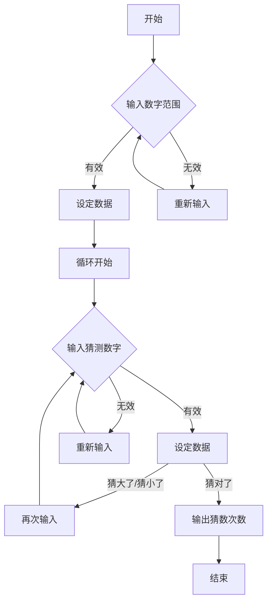

# FUN-0001-猜数字游戏


## 🔍使用说明
### 简介：
这是一个经典的猜数字游戏。  
通过设定数字范围，随机设定数字，人为猜测数字以缩小范围，最终找到正确数字的游戏。
### 示例：
```
[START]
欢迎来到猜数字游戏！
请输入数字范围（0~N）：10[Typed]
现在游戏开始！
------------------------------
请输入你的猜测：5[Typed]
猜小了，或许大胆一些比较好！
------------------------------
请输入你的猜测：7[Typed]
恭喜你，猜中了！
------------------------------
游戏结束,本轮猜数次数为2次！
按任意键退出...
[END]
```
### 运行环境：
Python的各发行版本。  
本代码测试环境为：`Python 3.13.7 on win32`
### 功能依赖：
```python
import random
```
`random`是Python的内置库。  
这意味着你无需额外安装任何第三方库就可以运行程序。


## 📊程序设计
### 调用函数：  
`guess_num()`：这是程序的主函数，包含程序主体内容，`return`值为空。  
`random.randint()`：用于产生范围内的随机数。  
`while/if/try/etc.`：这些是Python内置基本函数，不作过多说明。
### 程序结构：
以下是此程序的简单流程图。  

  
程序主要通过`while`循环与`if-elif-else`处理分支实现。  
在`try-except`异常处理中用到了简单的`递归`。  
  
理论上来讲，该程序的最大`输入范围`为最大整型值。  
而Python的整型数据类型int在存储上是`没有限制范围`的，可以表示非常大的整数。  
Python提供了内置的函数和模块来获取整型数据的最大值和最小值。你可以通过相关文档来获取最大值。  


## 🌍开发说明
这是FUN系列的第一个项目。  
  
FUN系列主要收录入门级较简单的娱乐项目，主要目的是实现某个功能，不深究算法与结构。  
（当然也可以有些无用的`赤石科技`）  
这些项目虽然看起来非常简单，但也算是回归了学习的初衷。
    
毕竟，
```
Interest is the best teacher.   (兴趣是最好的老师。)
```
  
希望你也可以从这些简单但有趣的项目中找到对抗无趣生活的有力武器。

